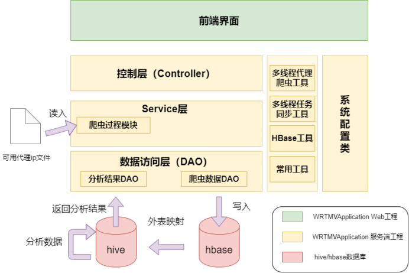
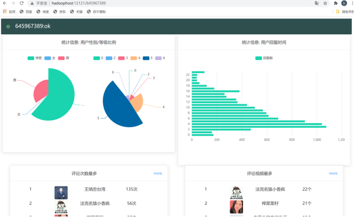
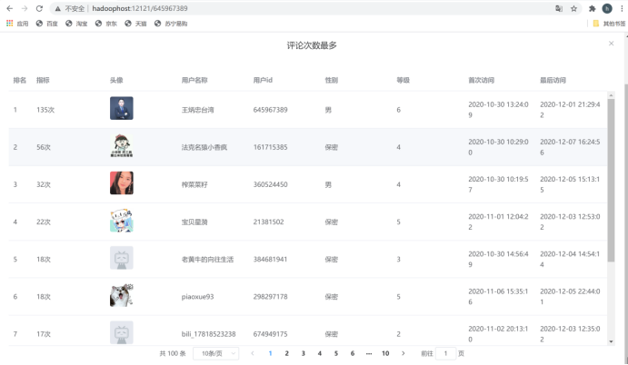

# B站up主评论区用户分析系统

## 实现功能

1. 通过调用b站的api接口爬取B站up主的视频数据以及视频评论区数据，存储到hbase数据库中。

2. 在hive中创建hbase表的外表，通过hive的Java编程接口对爬取的数据进行分析。

3. 将分析结果返回前端界面进行展示。

## 项目组成

## 项目界面

### 入口页

在输入框中输入要统计的b站id，点击I’ m sure跳转到分析界面。

### 统计页

- 点击活跃用户榜的more按钮查看更多用户

- 点击用户头像跳转打开用户的b站空间

## 使用说明

本项目最终采用前后端集成部署的方案，因此whoreplytomyvideosweb前端vue项目打包好的页面需放在whoreplytomyvideosserver项目的resources文件夹下。

将whoreplytomyvideosserver打包后部署到服务器上，使用jar命令直接运行